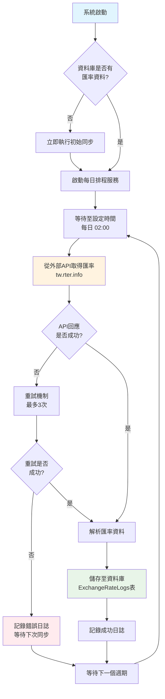
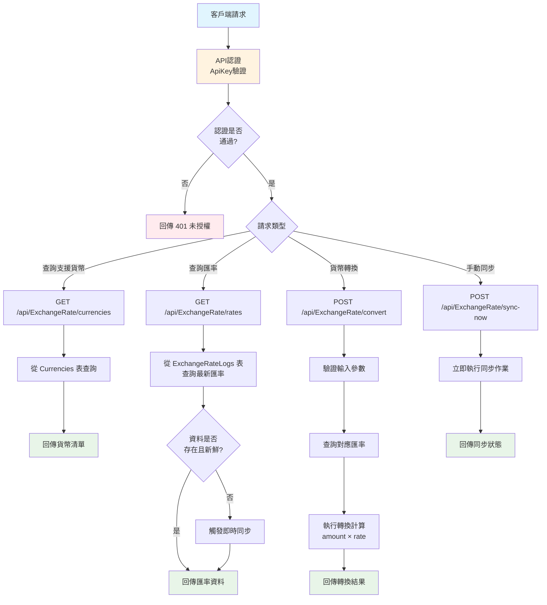
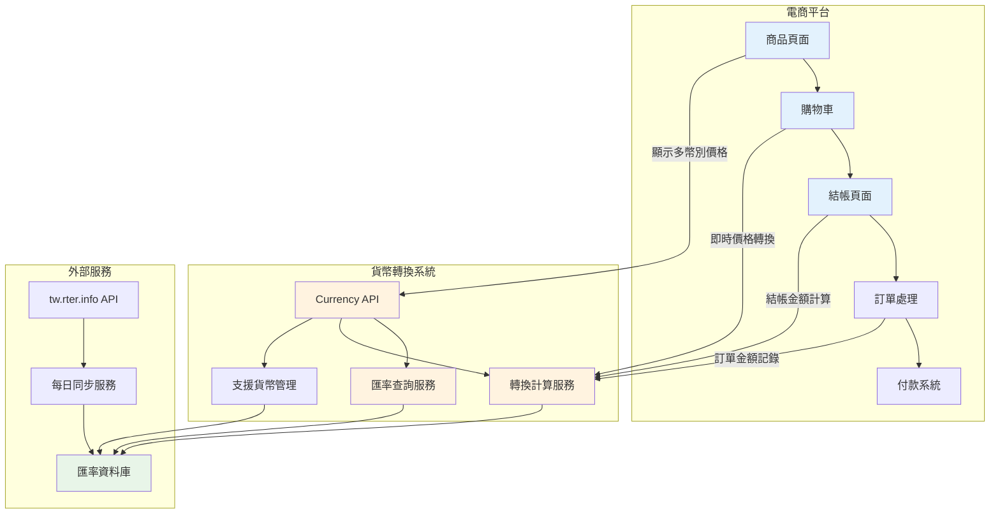
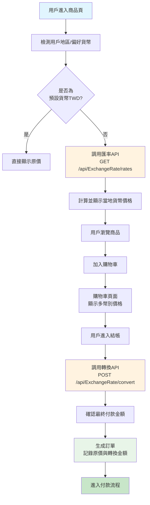
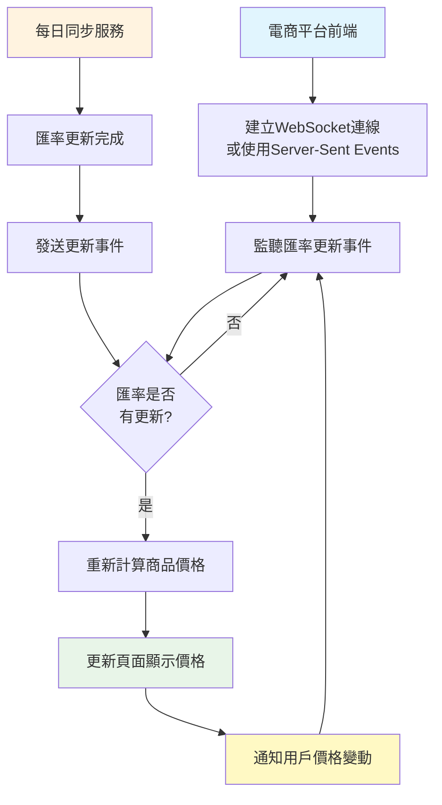
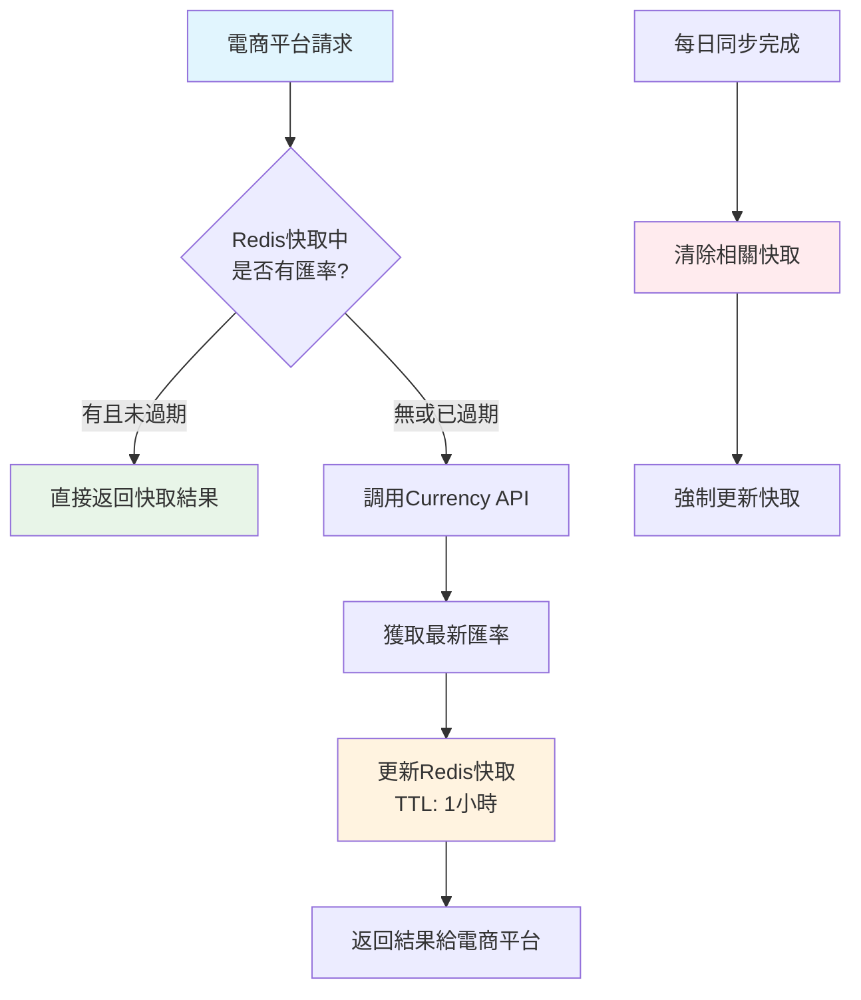

# 貨幣轉換系統流程圖與電商平台整合方案

## 1. 系統主要業務流程圖

### 1.1 每日自動同步流程



### 1.2 API 服務流程



## 2. 電商平台整合方案

### 2.1 整合架構圖



### 2.2 電商平台整合流程



### 2.3 實時價格更新流程



## 3. 技術整合細節

### 3.1 API 整合範例

#### 前端 JavaScript 整合
```javascript
// 取得支援的貨幣清單
async function getSupportedCurrencies() {
    const response = await fetch('/api/ExchangeRate/currencies', {
        headers: {
            'X-API-Key': 'your-api-key'
        }
    });
    return await response.json();
}

// 即時貨幣轉換
async function convertPrice(amount, fromCurrency, toCurrency) {
    const response = await fetch('/api/ExchangeRate/convert', {
        method: 'POST',
        headers: {
            'Content-Type': 'application/json',
            'X-API-Key': 'your-api-key'
        },
        body: JSON.stringify({
            fromCode: fromCurrency,
            toCode: toCurrency,
            amount: amount
        })
    });
    return await response.json();
}
```

#### 後端服務整合
```csharp
public class ProductService
{
    private readonly IHttpClientFactory _httpClientFactory;
    
    public async Task<ProductPriceDto> GetProductWithLocalPrice(
        int productId, string targetCurrency)
    {
        var product = await GetProduct(productId);
        
        // 調用貨幣轉換API
        var client = _httpClientFactory.CreateClient();
        client.DefaultRequestHeaders.Add("X-API-Key", "your-api-key");
        
        var convertRequest = new
        {
            fromCode = "TWD",
            toCode = targetCurrency,
            amount = product.Price
        };
        
        var response = await client.PostAsJsonAsync(
            "http://currency-api/api/ExchangeRate/convert", 
            convertRequest);
            
        var convertResult = await response.Content
            .ReadFromJsonAsync<ConvertResultDto>();
            
        return new ProductPriceDto
        {
            ProductId = product.Id,
            OriginalPrice = product.Price,
            OriginalCurrency = "TWD",
            LocalPrice = convertResult.ConvertedAmount,
            LocalCurrency = targetCurrency,
            ExchangeRate = convertResult.Rate
        };
    }
}
```

### 3.2 快取策略



## 4. 系統優勢與商業價值

### 4.1 核心優勢
- ✅ **自動化**: 每日自動同步，無需人工干預
- ✅ **可靠性**: 多重重試機制，確保資料準確性
- ✅ **即時性**: 提供最新匯率，支援即時轉換
- ✅ **擴展性**: 支援12種主流貨幣，可輕鬆擴展
- ✅ **監控**: 完整的日誌記錄和健康檢查機制

### 4.2 商業價值
- 🌍 **國際化支援**: 讓電商平台輕鬆進軍國際市場
- 💰 **提升轉換率**: 用戶看到本地貨幣價格，更容易下單
- 🔧 **降低維護成本**: 自動化同步，減少人工作業
- 📊 **數據準確**: 官方匯率來源，確保計算準確性
- ⚡ **效能優化**: 資料庫快取，提供快速查詢服務

### 4.3 實施時程建議

| 階段 | 工作項目 | 時程 | 負責單位 |
|------|----------|------|----------|
| 第一階段 | API整合測試 | 1週 | 技術團隊 |
| 第二階段 | 前端多幣別顯示 | 2週 | 前端團隊 |
| 第三階段 | 購物車轉換功能 | 1週 | 全端團隊 |
| 第四階段 | 訂單系統整合 | 1週 | 後端團隊 |
| 第五階段 | 效能優化與監控 | 1週 | DevOps團隊 |

## 5. 風險評估與應對策略

### 5.1 主要風險
- ⚠️ **外部API依賴**: tw.rter.info API可能不穩定
- ⚠️ **匯率波動**: 快速變動可能影響訂單價格
- ⚠️ **系統負載**: 高流量時可能影響響應速度

### 5.2 應對策略
- 🔄 **多資料源**: 考慮整合備用匯率來源
- 📝 **價格鎖定**: 在結帳時鎖定匯率一定時間
- 🚀 **效能優化**: 實施快取和CDN策略
- 📊 **監控告警**: 建立完整的監控和告警機制

---

*此文檔提供了完整的系統流程說明和電商平台整合方案，適合向上級報告使用。*
